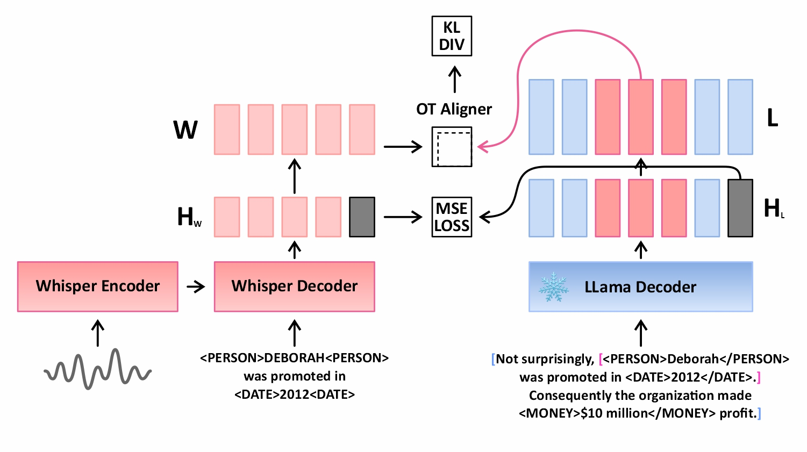
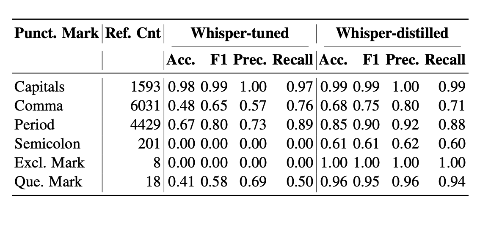
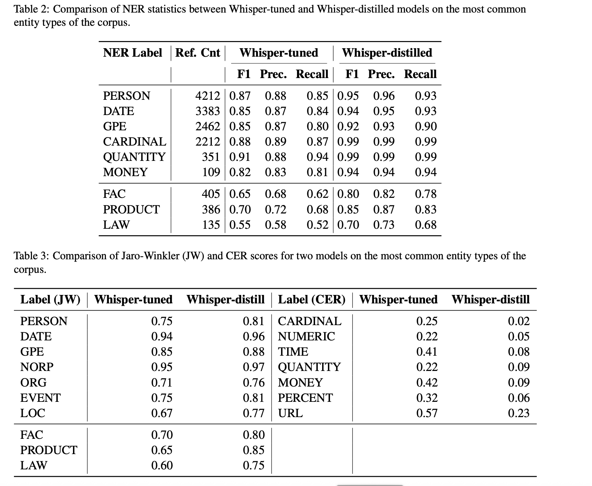

# Whispering Context: Distilling Syntax and Semantics for Long Speech Transcripts

This is the repo for IEEE ASRU 2025 paper [Whispering Context: Distilling Syntax and Semantics for Long Speech Transcripts](). You can reach the preprint at [Arxiv](https://www.arxiv.org/abs/2508.13376).

Our work offers a novel approach for blending transcript syntax&semantics into training chunks. We propose a novel approach that enhances ASR by distilling contextual knowledge from LLaMA models into Whisper. We measure syntactic&semantic success by measuring NER success, punctuation and capitalization success.

A key innovation of our approach is the use of an extended context window during representation-level distillation to provide Whisper with richer textual clues. Instead of
distilling knowledge solely from LLaMA’s representation of the chunk text (e.g., a 30-second segment), we incorporate a broader context from the entire transcript. Specifically, for
a fixed context size of tokens, we include half the tokens preceding the chunk and half following it within the transcript, effectively expanding the semantic scope available during
distillation. We experimented with various context sizes—64, 128, 256, 512, and 1024 tokens—and observed that increasing the context size significantly improved NER performance
by enabling Whisper to leverage more semantic information from the surrounding text. This extended context trick proved particularly effective for handling long-tail entities, where
global transcript-level understanding is critical for accurate recognition and formatting. Below figure exhibits an overview of our approach.

</img>

## Data preparation
We worked on SpokenWikipedia dataset,chosen for its long-audio and rich set of entity types and formats. The data came in aligned version and multiword entities are given by the XML format, so we processed **whole** transcripts such that they include entity tags like this:

</img>

Though multiword entities are provided by the dataset format, still we needed to extract single-word entities , also all the entity types. The below diagram shows the outline of burying entity tags to the transcript:

</img>

This pipeline is called the **ReverseNormalizer**, consisting of two modules, first one is **NER** to tag the entities with their types; the second module is called **EntityFormatter** which formats entities according to their types, calculates entity boundaries and inserts the tags into the transcript text.

## Results
Results are ultra interesting.

Whisper-Medium achieved a 0.38, which is reasonable given the complexity of the transcripts. Planed fine-tuned version reduced the WER to 0.26. Our distilled Whisper managed to take WER down to 0.20.

Now comes the punctuation results:

</img>

and semantic success per entity type:

</img>

Entities are evaluated according to their types. numerical types with CER and textual entities with Jaro-Winkler distance.
Please find more explanations of the results in the paper.
## Running the experiment

To run the experiments

- Generate and persist speech features by `generate_features/featurize.py`
- Generate LlaMa tensors by `generate_llama_tensors/get_vectors_quantized.py`
- Run the experiment by `distill/run.sh`
